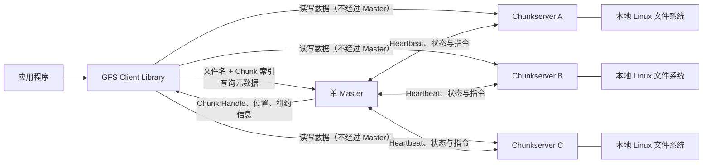
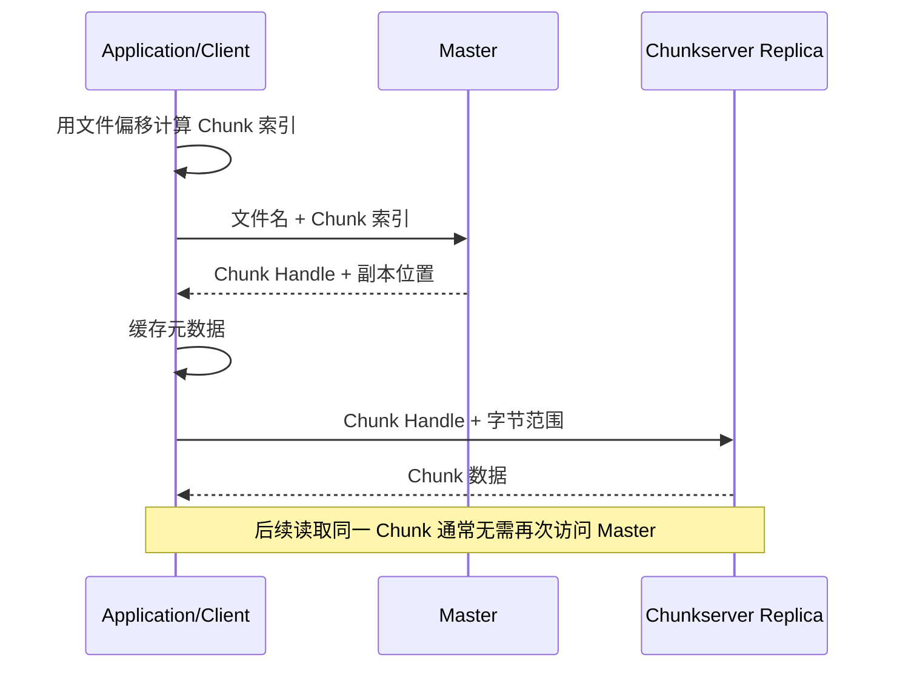
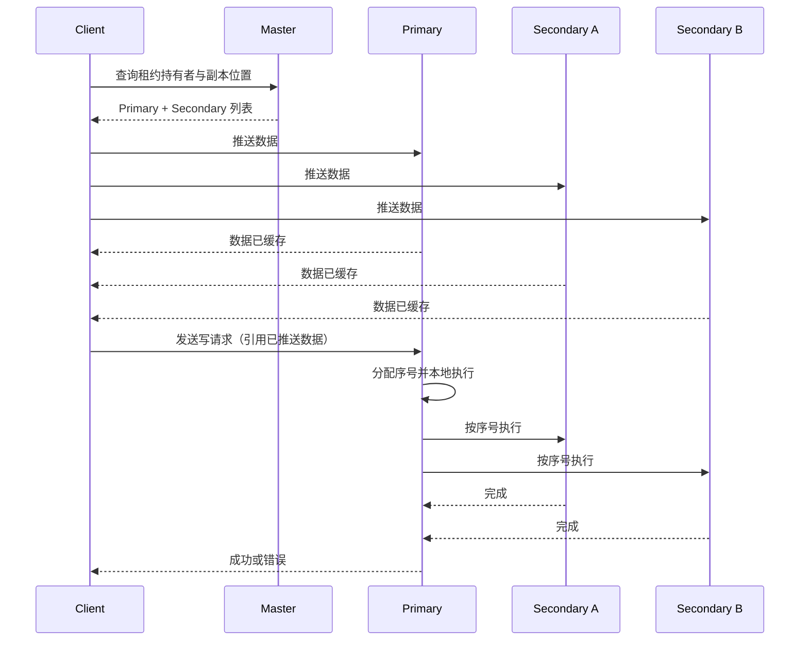

# The Google File System 论文知识笔记

> 论文：**The Google File System**（SOSP 2003）  
> 作者：Sanjay Ghemawat、Howard Gobioff、Shun-Tak Leung  
> 研读材料：`/home/skynit/Downloads/gfs.pdf`  
> 页码说明：本文中的页码指 PDF 页码；章节号沿用论文原编号。

## 一、一句话概括

GFS 不是试图制造一套“更通用、更标准”的文件系统，而是从 Google 的真实负载出发，主动放弃 POSIX、低延迟和强一致性等传统目标，通过**单 Master 管理元数据、客户端直连 Chunkserver 传输数据、64 MB 大块、三副本、租约排序、原子记录追加、后台自动修复**，换取面向海量数据处理的简单性、容错能力和高聚合吞吐。

## 二、论文要解决的问题

Google 当时需要在大量廉价机器上存储、生成和处理超大数据集。传统分布式文件系统的一些默认假设不再成立：

1. **故障不是例外，而是常态**
   - 集群由数百至数千台普通机器和更多磁盘组成。
   - 磁盘、内存、网络、电源、操作系统、应用程序乃至人工操作都会出错。
   - 系统必须内建持续监控、错误检测、自动恢复与副本修复。

2. **文件非常大**
   - 常见文件达到数百 MB 或数 GB，一个文件内部包含大量应用对象。
   - 与管理数十亿个 KB 级小文件相比，把许多对象聚合进大文件更符合当时 Google 的场景。

3. **主要写入模式是追加，而非覆盖**
   - 文件通常一次生成，之后很少修改，并被顺序读取。
   - 随机覆盖写存在，但不值得重点优化。
   - 多个生产者并发追加到同一个文件是常见需求。

4. **高持续吞吐比单次操作的低延迟更重要**
   - 目标应用是批量数据处理，而不是交互式、小 I/O、低延迟业务。

5. **应用与文件系统可以协同设计**
   - Google 同时控制 GFS 与上层应用，因此可以改变 API 和应用写法，而不必维护完整 POSIX 兼容。

### 核心问题重述

GFS 的问题不是“如何在分布式环境中完整复刻本地文件系统”，而是：

> 如何用大量会故障的廉价机器，为超大文件、顺序读、追加写和并发数据处理提供可扩展、高吞吐、可自动恢复的存储底座？

## 三、总体架构

### 3.1 三类角色

| 角色 | 主要职责 |
|---|---|
| **Master** | 管理命名空间、文件到 Chunk 的映射、Chunk 版本、租约、副本放置、再复制、迁移、垃圾回收等全局控制面 |
| **Chunkserver** | 在本地 Linux 文件系统中保存 Chunk 副本，响应客户端读写，维护校验和与版本信息 |
| **Client** | 作为库链接进应用；向 Master 查询元数据，然后直接与 Chunkserver 传输数据 |

### 3.2 控制面与数据面分离

这是论文最重要的架构决策之一：

- **控制面经过 Master**：命名空间、Chunk 定位、租约、副本管理。
- **数据面绕过 Master**：客户端直接从 Chunkserver 读取或向多个副本传输数据。

由此得到一个看似矛盾但实际有效的组合：

- 用**单 Master**获得集中式全局决策的简单性；
- 用**数据旁路、元数据缓存、大 Chunk 和租约**避免单 Master 成为数据吞吐瓶颈。

## 四、关键设计决策

## 4.1 单 Master

### 为什么敢用单 Master

单 Master 让系统拥有统一的全局视图，便于实现：

- 副本放置与跨机架分布；
- 再复制优先级；
- 磁盘和负载均衡；
- Chunk 迁移；
- 垃圾回收；
- 命名空间操作的全局排序。

### 如何避免 Master 成为瓶颈

1. 文件数据不经过 Master；
2. 客户端缓存 Chunk Handle 和副本位置；
3. 64 MB 大 Chunk 减少元数据量和查询次数；
4. 一次元数据请求可以顺带返回后续 Chunk 信息；
5. 写入排序权通过租约下放给 Primary 副本。

### 局限

- 单 Master 是控制面的单点，主进程失效时写和元数据变更会中断；
- 论文通过操作日志复制、快速重启、外部监控迁移 Master 和只读 Shadow Master 缓解，而不是实现完整的自动同步主备切换；
- 超大量小文件会显著扩大 Master 元数据并增加访问压力。

## 4.2 64 MB 大 Chunk

文件被切分为固定大小的 **64 MB Chunk**；每个 Chunk 有一个由 Master 分配的、不可变且全局唯一的 64 位 Handle。默认保存三个副本。

### 优点

- 减少客户端向 Master 查询 Chunk 位置的次数；
- 减少 Master 内存中的元数据量；
- 客户端可长期复用与 Chunkserver 的 TCP 连接；
- 符合大文件、连续读写的负载。

### 代价

- 小文件可能只有一个 Chunk；如果大量客户端同时读取，会使少数 Chunkserver 成为热点；
- 论文中的批处理系统曾同时向数百台机器分发一个单 Chunk 可执行文件，造成热点；解决方式包括提高副本数和错开启动时间；
- 大 Chunk 并不适用于小文件密集、随机访问占主导的通用存储场景。

### 空间问题

Chunkserver 使用本地普通文件保存 Chunk，并采用惰性空间分配，因此 64 MB 是逻辑上限，不会在创建时立刻占满全部空间。

## 4.3 元数据全部放在 Master 内存

Master 保存三类主要元数据：

1. 文件与 Chunk 命名空间；
2. 文件到 Chunk 的映射；
3. Chunk 副本所在位置。

其中：

- 前两类通过**操作日志**持久化；
- Chunk 位置不持久化，Master 启动时直接向各 Chunkserver 询问。

### 为什么 Chunk 位置不持久化

Chunkserver 才是“自己磁盘上到底有什么”的最终事实来源。机器重启、磁盘故障、改名和副本丢失都可能使 Master 的持久化位置表过时。启动时重新汇报比维护两套严格同步的持久状态更简单可靠。

### 内存成本

论文给出的量级是：

- 每个 64 MB Chunk 的 Master 元数据少于约 64 字节；
- 文件名采用前缀压缩；
- 实际集群的 Master 元数据只有几十 MB，平均约每个文件 100 字节。

这再次说明 GFS 是针对“数量适中但体积很大的文件”优化的。

## 4.4 操作日志与 Checkpoint

操作日志是 GFS 元数据可靠性的中心：

- 它是关键元数据变更的持久化记录；
- 它定义并发元数据操作的全局逻辑时间顺序；
- 只有日志记录在本地和远端副本落盘后，变更才对客户端可见；
- Master 批量刷写多个日志记录，以降低同步落盘成本。

为避免日志无限增长，Master 周期性创建 Checkpoint：

1. 切换到新的日志文件；
2. 后台线程构建旧状态的紧凑 Checkpoint；
3. Checkpoint 写入本地及远端；
4. 恢复时加载最新完整 Checkpoint，再重放后续日志。

Checkpoint 采用可直接映射进内存的紧凑 B-tree 类结构。未完成的 Checkpoint 会被恢复逻辑忽略。

## 五、读写流程

## 5.1 读取流程

客户端一般选择网络上“最近”的副本读取。重新打开文件时会清理该文件的 Chunk 位置缓存，以缩短读取陈旧副本的窗口。

## 5.2 普通写入流程：租约与 Primary 排序

每次数据变更都必须应用到 Chunk 的各副本。为了让所有副本采用相同顺序，Master 给某个副本授予租约，使其成为 **Primary**：

- Master 决定租约授予顺序；
- Primary 对租约期内的变更分配连续序号；
- Secondary 按 Primary 指定的顺序执行。

租约初始有效期为 60 秒，可通过 Heartbeat 携带续租请求。

### 数据流和控制流解耦

- **控制流**：Client → Primary → Secondary；
- **数据流**：沿按网络距离选择的 Chunkserver 链线性、流水线传输。

线性链避免一台机器把出口带宽分给多个接收者；流水线使节点收到一部分数据后立即向下一节点转发。论文给出的理想传输耗时为：

\[
\frac{B}{T} + R L
\]

其中 \(B\) 是数据量，\(T\) 是网络吞吐，\(R\) 是副本数，\(L\) 是节点间传输延迟。

### 失败语义

如果部分副本成功而其他副本失败：

- 客户端得到失败结果并重试；
- 被修改区域可能暂时处于不一致状态；
- GFS 不通过复杂事务回滚所有副本，而是依靠重试、版本号、应用层校验和后台修复处理。

## 六、原子记录追加（Record Append）

Record Append 是 GFS 面向分布式应用做出的关键 API 扩展。

### 普通写与 Record Append 的区别

| 操作 | 偏移由谁决定 | 并发结果 |
|---|---|---|
| 普通 Write | 客户端指定 | 并发写同一区域时可能混入多个写入的片段 |
| Record Append | GFS/Primary 选择 | 每条记录至少一次、以连续字节序列原子写入 |

### 语义

- 客户端只提供记录内容，不提供写入偏移；
- GFS 选择偏移并返回给客户端；
- 每条成功记录保证**至少写入一次**且单条记录不被拆散；
- 失败重试可能造成重复记录、填充区或不完整片段；
- 因而它是 **at-least-once**，不是 exactly-once；
- 单次追加大小最多为 Chunk 最大尺寸的四分之一，以控制最坏情况下的碎片浪费。

### 跨 Chunk 边界

如果当前 Chunk 剩余空间不足：

1. Primary 将当前 Chunk 填充到 64 MB；
2. 要求 Secondary 做相同填充；
3. 通知客户端在下一个 Chunk 重试。

### 应用如何处理重复和填充

论文建议每条记录自带：

- 唯一 ID：去重；
- Checksum：识别损坏、填充和记录碎片；
- 自描述边界：让读取器找到有效记录。

这体现了 GFS 的系统边界选择：**文件系统提供简单、高效的至少一次追加，应用层用幂等、去重和自校验补足语义。**

## 七、一致性模型

## 7.1 两个概念

- **一致（consistent）**：无论从哪个副本读取，所有客户端都看到相同数据。
- **已定义（defined）**：区域不仅一致，而且客户端看到的是某次变更完整写入的内容。

“已定义”比“一致”更强：已定义必然一致，一致不一定已定义。

## 7.2 数据变更后的状态

| 场景 | 普通 Write | Record Append |
|---|---|---|
| 无并发且成功 | 已定义 | 已定义 |
| 并发且均成功 | 一致但未定义，可能混合多个写入片段 | 成功记录所在区域已定义，记录之间可能夹有不一致区域 |
| 失败 | 不一致 | 不一致 |

### 为什么并发普通写可能“一致但未定义”

所有副本按相同顺序执行操作，因此最终字节相同；但大写入可能被拆成多个子操作，并与其他客户端操作交错，所以结果不一定等于任何一个调用者原本想写入的完整内容。

### 应用适配方法

1. 优先追加，不做覆盖写；
2. 完整生成临时文件后用原子 Rename 发布；
3. 周期性 Checkpoint，仅让读取器处理已确认完成的区域；
4. 记录携带 Checksum 和唯一 ID；
5. 让消费逻辑幂等，能够跳过重复记录。

这套模型的关键不是“没有一致性”，而是**明确保证边界，把更昂贵的语义留给真正需要它的应用**。

## 八、Snapshot

GFS 用 Copy-on-Write 快速创建文件或目录树快照：

1. Master 撤销相关 Chunk 的租约，保证后续写入必须重新联系 Master；
2. 将快照操作写入日志；
3. 复制源文件或目录树的元数据，新旧文件暂时引用相同 Chunk；
4. 第一次有人写共享 Chunk 时，Master 分配新 Handle；
5. 原 Chunk 所在 Chunkserver 在本机复制副本，避免跨网络复制；
6. 新 Chunk 获得租约后正常写入。

快照被用于：

- 快速复制大数据集；
- 创建实验分支；
- 建立 Checkpoint；
- 支持易于提交或回滚的数据处理流程。

## 九、Master 的全局管理

## 9.1 命名空间与锁

GFS 没有传统的“目录对象中保存子项列表”，而是把完整路径映射到元数据，并使用前缀压缩。

每个命名空间节点关联读写锁。对 `/d1/d2/file` 的操作通常：

- 对各级目录路径加读锁；
- 对最终路径加读锁或写锁。

这样可以：

- 防止快照、删除、重命名与文件创建冲突；
- 允许同一目录下不同文件并发创建；
- 通过固定的全序获取锁，避免死锁。

## 9.2 副本放置

副本不仅要分散到不同机器，还要跨机架放置，目标是：

- 单机、磁盘或整机架故障时仍有可用副本；
- 读取可利用多个机架的聚合带宽。

代价是每次写入可能跨机架传输数据，但论文认为这是值得的可靠性权衡。

新 Chunk 的放置考虑：

1. 优先选择磁盘利用率低于平均值的 Chunkserver；
2. 限制单台服务器最近创建的 Chunk 数，因为新 Chunk 往往意味着即将到来的大量写流量；
3. 跨机架分布副本。

## 9.3 再复制与再平衡

当副本数低于目标值时，Master 按优先级修复：

- 离目标副本数越远，优先级越高；
- 活跃文件优先于近期删除文件；
- 阻塞客户端进度的 Chunk 提升优先级；
- 复制任务限制集群级和单机并发数，并进行带宽节流，避免压垮正常业务。

Master 还会周期性迁移副本，实现磁盘空间与负载均衡，并渐进式填充新加入的 Chunkserver。

## 9.4 延迟垃圾回收

删除文件时不立即回收物理空间：

1. 文件被重命名为带删除时间戳的隐藏名称；
2. 默认保留三天，期间可以恢复；
3. Master 扫描命名空间后删除过期隐藏文件元数据；
4. 失去文件引用的 Chunk 成为孤儿；
5. Chunkserver 在 Heartbeat 汇报持有的 Chunk，Master 通知其删除已不在元数据中的副本。

### 延迟回收的好处

- 统一处理创建了一半、删除消息丢失、节点离线等异常残留；
- 将回收合并进后台批处理，降低前台延迟；
- 为误删提供恢复窗口；
- 比在故障频繁的分布式环境中追求即时、精确删除更简单可靠。

### 代价

空间紧张时，临时文件反复创建和删除会导致空间不能立即复用。GFS 允许显式加速回收，并为不同命名空间设置不同复制与回收策略。

## 9.5 陈旧副本检测

Chunkserver 宕机期间可能错过写入。GFS 用 **Chunk Version Number** 检测陈旧副本：

1. Master 授予新租约前递增 Chunk 版本号；
2. Master 和在线的最新副本持久化新版本；
3. 离线副本因未更新版本而变陈旧；
4. 节点恢复并汇报版本后，Master 将陈旧副本排除出读写与复制来源；
5. 后续由垃圾回收删除。

版本号解决的是“副本是否参与了最新一轮租约写入”，而不是比较副本的每个字节。

## 十、容错、可用性与数据完整性

## 10.1 快速恢复

Master 与 Chunkserver 都被设计成无论正常退出还是异常退出，都能在数秒内恢复状态。系统不特别区分“优雅关闭”和“崩溃”，客户端通过超时、重连和重试度过短暂中断。

## 10.2 Chunk 副本

- 默认三副本；
- 跨机架放置；
- 节点离线或校验失败后自动克隆有效副本；
- 论文也提到，针对不断增长的只读数据，未来可考虑校验码或纠删码，但当时优先选择实现简单的复制。

## 10.3 Master 状态复制

- 操作日志和 Checkpoint 保存到多台机器；
- 元数据变更只有在本地与所有 Master 副本的日志都落盘后才算提交；
- 主 Master 失败后，外部监控可以在其他机器上用复制日志启动新 Master；
- 客户端通过可切换的 DNS 别名访问 Master；
- Shadow Master 重放操作日志，提供可能略滞后的只读元数据访问。

Shadow Master 读取的文件内容仍来自 Chunkserver；可能陈旧的主要是目录内容、权限等元数据。

## 10.4 Checksum

每个 Chunk 被划分为 **64 KB Block**，每块保存一个 **32 位 Checksum**。

### 读取时

1. Chunkserver 在返回数据前校验覆盖读取范围的 Block；
2. 失败则返回错误并向 Master 报告；
3. 客户端改读其他副本；
4. Master 从有效副本重建新副本，再删除损坏副本。

### 写入时

- 对尾部追加做增量 Checksum 更新；
- 覆盖写需要先读并验证首尾 Block，避免新的 Checksum 掩盖未覆盖部分的旧损坏；
- 空闲期后台扫描冷 Chunk，发现长期未被读取的数据损坏。

GFS 不通过跨副本逐字节比较检测损坏，因为 Record Append 合法情况下也可能让不同副本的填充和重复内容不完全相同；每个 Chunkserver 必须独立验证自己的副本。

## 10.5 诊断日志

所有服务器记录：

- 关键状态事件；
- RPC 请求与响应，但不记录实际文件数据；
- 最近事件的内存副本，用于在线监控。

通过跨机器匹配 RPC 日志，可以重建分布式交互历史。日志采用顺序、异步写，性能成本较低，却极大改善了瞬态故障定位、负载测试和性能分析。

## 十一、实验与生产数据

## 11.1 微基准环境

论文测试集群包含：

- 1 个 Master、2 个 Master 副本；
- 16 个 Chunkserver、16 个 Client；
- 每台机器双 1.4 GHz PIII、2 GB 内存、两块 80 GB 5400 rpm 磁盘；
- 单机 100 Mbps 全双工网络，两台交换机之间 1 Gbps。

### 读

- 单客户端约 10 MB/s，达到单机网络上限的约 80%；
- 16 客户端聚合约 94 MB/s，约为 125 MB/s 理论链路上限的 75%；
- 客户端越多，多个读取同时命中同一 Chunkserver 的概率越高。

### 写

- 三副本使理论聚合上限约为 67 MB/s；
- 单客户端约 6.3 MB/s；
- 16 客户端聚合约 35 MB/s；
- 主要限制来自网络栈与流水线数据传播延迟，以及多个写请求在 Chunkserver 上发生碰撞。

### Record Append

- 多客户端向单文件追加时，瓶颈是最后一个 Chunk 所在副本的网卡；
- 1 个客户端约 6.0 MB/s，16 个客户端约 4.8 MB/s；
- 实际应用通常并发写多个共享文件，因此单文件热点不完全代表整体生产吞吐。

## 11.2 两个真实集群

论文给出的两个代表性集群：

| 指标 | 集群 A（研发） | 集群 B（生产处理） |
|---|---:|---:|
| Chunkserver | 342 | 227 |
| 可用磁盘空间 | 72 TB | 180 TB |
| 已使用空间（含副本） | 55 TB | 155 TB |
| 文件数 | 约 73.5 万 | 约 73.7 万 |
| Chunk 数 | 约 99.2 万 | 约 155 万 |
| Master 元数据 | 48 MB | 60 MB |

可观察到：

- Master 元数据非常小，支持全部放内存；
- 真实负载读多写少，且大块 I/O 承担主要传输字节；
- Master 每秒约处理 200 至 500 个请求，不是当时工作负载的瓶颈；
- 研发集群曾持续一周维持约 580 MB/s 读吞吐；
- 生产集群写入突发约 100 MB/s 时，三副本会产生约 300 MB/s 网络负载。

## 11.3 故障恢复实验

- 杀死集群 B 中一台含约 15,000 个 Chunk、600 GB 数据的 Chunkserver 后，全部副本在 23.2 分钟内恢复，等效复制速率约 440 MB/s；
- 同时杀死两台各含约 16,000 个 Chunk、660 GB 数据的 Chunkserver 后，266 个仅剩单副本的高风险 Chunk 在 2 分钟内恢复到至少双副本。

关键不只是“最终会恢复”，而是**根据数据丢失风险排序，优先缩短最危险窗口**。

## 十二、工程经验

论文第 7 节体现了真实系统与抽象算法之间的差距。

### 12.1 从生产底座扩展到研发共享平台

GFS 最初服务受控的生产系统，后来被大量研发用户使用，暴露出权限、配额与租户隔离不足。系统设计必须考虑未来使用者可能比原始应用更不受控。

### 12.2 硬盘和内核会静默损坏数据

部分 IDE 硬盘与 Linux 驱动对协议版本的理解不一致，系统表面大多正常，却偶尔静默破坏数据。这直接推动 GFS 引入 Checksum。

经验是：

> 副本只能抵御“有额外正确副本的损坏”；要先检测出静默损坏，副本才有意义。

### 12.3 `fsync()` 的实现细节会影响系统架构

Linux 2.2 中 `fsync()` 成本与整个文件大小相关，而不是与本次修改大小相关，导致大型操作日志成本高。Checkpoint 不仅缩短恢复时间，也控制日志大小和落盘成本。

### 12.4 `mmap()` 的全局锁导致瞬态超时

Linux 地址空间中的读写锁使磁盘换页与网络线程映射新数据互相阻塞。GFS 用 `pread()` 替换 `mmap()`，以一次额外内存复制换取更稳定的并发行为。

这说明在分布式系统中，偶发尾延迟可能来自单机内核内部的隐式锁，而不是网络或分布式协议本身。

## 十三、论文的核心设计思想

## 13.1 从负载出发，而不是从标准出发

GFS 的成功不是因为每项技术都新，而是因为它把系统目标限定得足够清楚：

- 大文件；
- 大块、顺序 I/O；
- 追加优先；
- 大量并发客户端；
- 廉价且经常故障的硬件；
- 高聚合吞吐；
- 应用可配合文件系统语义。

只有在这些前提下，64 MB Chunk、放松一致性、不缓存数据和单 Master 才同时合理。

## 13.2 把集中式决策与分布式执行结合

- Master 做全局、低频、需要统一视图的决策；
- Chunkserver 做高频数据传输与本地完整性检查；
- Primary 在租约期内承担局部排序；
- Client 缓存元数据并直连数据节点。

这不是简单的“中心化”或“去中心化”，而是按职责划分控制权。

## 13.3 用后台收敛代替前台完美

GFS 多处采用相同模式：

- 删除不立即彻底完成，而是后台垃圾回收；
- 副本不足不阻塞所有操作，而是后台按优先级修复；
- 节点恢复后通过版本号识别陈旧副本；
- 损坏通过读取校验和后台扫描发现，再自动克隆；
- Master 恢复通过 Checkpoint + 日志重放收敛状态。

共同原则是：前台路径保持简单、快速，后台机制让系统最终回到健康状态。

## 13.4 端到端语义分层

GFS 不强行提供 exactly-once 记录追加，而是：

- 存储层：至少一次、原子记录、可能重复；
- 记录层：Checksum、自描述边界；
- 应用层：唯一 ID、去重、幂等。

当上层本就需要 ID 和校验时，把所有语义压进文件系统反而会增加复杂度和成本。

## 13.5 可观测性是系统机制的一部分
/home/skynit/Uni/ming/
故障常常是瞬态、跨机器且不可复现的。全面 RPC 日志、事件日志和在线状态并非“辅助工具”，而是让大规模分布式系统能够被运营和调试的基础能力。

## 十四、局限与适用边界

GFS 不应被理解为通用分布式文件系统的唯一正确答案。

### 适合

- 大文件、批处理、分析型工作负载；
- 顺序读取和尾部追加；
- 需要高聚合吞吐；
- 上层应用可接受并处理重复、填充和较弱一致性；
- 硬件数量大、故障频繁、可通过副本自动恢复。

### 不适合或需要重新设计

- 海量小文件；
- 低延迟交互式访问；
- 高频随机覆盖写；
- 严格 POSIX 语义；
- 多记录事务和 exactly-once 追加；
- 强一致、线性一致的元数据高可用；
- 无法修改应用来适配存储语义的通用平台。

## 十五、可迁移到现代系统设计的启示

1. **先写清负载假设，再选架构。** 脱离负载讨论“单点”“块大小”或“一致性强弱”没有意义。
2. **故障检测与自动修复必须成对设计。** 只有副本没有校验，无法处理静默损坏；只有校验没有副本，无法恢复。
3. **优先处理风险，而非平均处理任务。** 再复制时先修复只剩一个副本、且阻塞业务的 Chunk。
4. **缩短 Master 的同步前台路径。** 将扫描、回收、迁移、Checkpoint 和修复放到后台，并进行限流。
5. **控制面可集中，数据面应绕行。** 全局策略不意味着所有流量都经过全局控制者。
6. **弱语义必须配套编程模型。** 放松一致性不是少做工作，而是把校验、去重、幂等和 Checkpoint 变成明确的应用规范与公共库。
7. **惰性机制能统一异常路径。** 延迟 GC 同时处理正常删除、消息丢失和孤儿副本，比维护复杂的即时分布式删除协议更可靠。
8. **真实瓶颈常在实现层。** 网络栈、`fsync()`、`mmap()` 锁和硬盘固件都可能推翻协议层的理想分析。
9. **大规模系统要为诊断而设计。** 如果无法重建一次跨节点交互，就很难可靠运营系统。

## 十六、需要记住的数字

| 项目 | 数值 |
|---|---:|
| Chunk 大小 | 64 MB |
| 默认副本数 | 3 |
| Chunk Handle | 64 位、不可变、全局唯一 |
| 租约初始时长 | 60 秒 |
| Checksum Block | 64 KB |
| 每块 Checksum | 32 位 |
| Record Append 最大记录 | 不超过 Chunk 大小的 1/4 |
| 删除恢复窗口 | 默认 3 天，可配置 |
| Master 单 Chunk 元数据 | 少于约 64 字节 |
| 真实集群 Master 元数据 | 数十 MB |

## 十七、术语表

| 术语 | 含义 |
|---|---|
| Chunk | 文件的固定大小数据分片，GFS 中最大 64 MB |
| Chunk Handle | Master 创建 Chunk 时分配的全局唯一 64 位标识 |
| Chunkserver | 保存并服务 Chunk 副本的数据节点 |
| Master | 管理命名空间、映射、租约、副本和后台任务的中心控制节点 |
| Lease | Master 临时授予某副本的排序权 |
| Primary | 当前租约持有者，负责确定 Chunk 内变更顺序 |
| Secondary | 按 Primary 指定顺序执行变更的其他副本 |
| Record Append | 由 GFS 选择偏移、保证单条记录至少一次原子追加的操作 |
| Defined | 所有客户端看到相同且完整属于某次变更的数据 |
| Consistent | 所有客户端从不同副本看到相同数据，但未必对应某次完整变更 |
| Stale Replica | 因离线错过新租约期变更、版本号落后的副本 |
| Shadow Master | 重放操作日志、提供略滞后只读元数据访问的 Master |

## 十八、复习问题

1. 为什么单 Master 在 GFS 中没有成为数据吞吐瓶颈？
2. 64 MB Chunk 如何同时降低 Master 压力和网络开销？它会制造什么热点问题？
3. 为什么 Chunk 位置不需要持久化在 Master？
4. 租约、Primary 和版本号分别解决什么问题？
5. 为什么数据先推送到所有副本，再向 Primary 发送写控制请求？
6. Record Append 为什么只能保证 at-least-once？应用如何达到业务上的 exactly-once 效果？
7. “一致但未定义”与“不一致”有什么区别？
8. 为什么 GFS 的合法副本不一定逐字节相同？
9. 延迟垃圾回收如何简化分布式删除和异常清理？
10. 为什么副本机制不能替代 Checksum？
11. GFS 的设计中，哪些结论依赖“大文件、追加写、高吞吐”的前提？
12. 如果目标变成海量小文件或低延迟随机写，应优先推翻哪些设计决策？

## 十九、最终总结

GFS 的真正贡献不只是“大 Chunk、三副本、单 Master”这些具体机制，而是一套完整的系统设计方法：

1. **承认环境现实**：硬件会坏、数据会损坏、进程会退出；
2. **识别主导负载**：大文件、顺序读、追加写、批处理；
3. **明确放弃非目标**：POSIX、通用小文件优化、严格强一致、低单次延迟；
4. **让架构服务于主路径**：集中控制、数据旁路、大块、租约与流水线；
5. **把故障变成日常后台工作**：监控、版本、校验、再复制、GC、快速恢复；
6. **让应用参与语义实现**：Checkpoints、自校验记录、唯一 ID、去重与幂等。

因此，阅读 GFS 最重要的不是记住它用了什么，而是理解：**优秀的大规模系统往往不是把所有性质都做到最强，而是在清晰的工作负载与故障模型下，选择一组彼此强化的取舍。**
