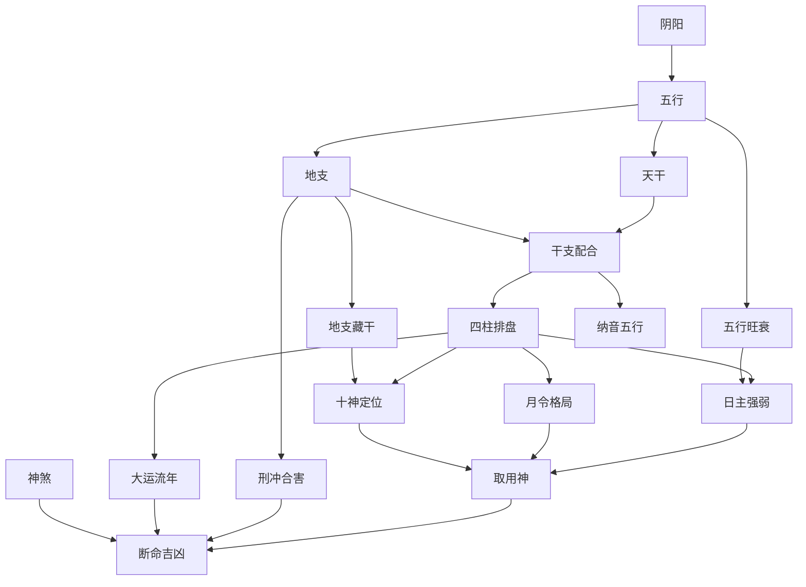

# 命理学关系索引与知识图谱

## 一、知识体系全景图

```
                        ┌─────────────┐
                        │   阴阳五行   │  ← 哲学根基
                        └──────┬──────┘
                               │
              ┌────────────────┼────────────────┐
              │                │                │
        ┌─────┴─────┐   ┌─────┴─────┐   ┌─────┴─────┐
        │  天干 (10) │   │  地支 (12) │   │  五行生克  │
        └─────┬─────┘   └─────┬─────┘   └─────┬─────┘
              │                │                │
              └───────┬────────┘                │
                      │                         │
               ┌──────┴──────┐           ┌──────┴──────┐
               │  六十甲子   │           │  五行旺衰   │
               │  纳音五行   │           │  旺相休囚死 │
               └──────┬──────┘           └──────┬──────┘
                      │                         │
              ┌───────┴─────────────────────────┘
              │
       ┌──────┴──────┐
       │   四柱八字    │  ← 核心框架
       │ 年·月·日·时柱 │
       └──────┬──────┘
              │
    ┌─────────┼─────────┬──────────────┐
    │         │         │              │
┌───┴───┐ ┌──┴───┐ ┌───┴────┐  ┌─────┴─────┐
│ 十神   │ │ 格局 │ │ 神煞   │  │  大运流年  │
│六亲关系│ │月令取│ │贵人驿马│  │  运势推移  │
└───┬───┘ │ 格   │ └───┬────┘  └─────┬─────┘
    │     └──┬───┘     │              │
    │        │         │              │
    └────┬───┘─────────┘──────────────┘
         │
  ┌──────┴──────┐
  │   取用神     │  ← 综合技法
  │  喜忌分析    │
  │  调候/扶抑  │
  └──────┬──────┘
         │
  ┌──────┴──────┐
  │   断命实践   │  ← 最终目标
  └─────────────┘
```

---

## 二、经典原文关系图

### 2.1 命理四书概览

| 书名 | 作者/编者 | 朝代 | 章节数 | 特色 | 路径 |
|------|----------|------|--------|------|------|
| [[渊海子平]] | 徐升（据徐子平法） | 宋 | 305 | 四柱法集大成，体系最完整 | `命理/渊海子平.md` |
| [[三命通会]] | 万民英 | 明 | 382 | 十干分论，日主为核心 | `命理/三命通会.md` |
| [[滴天髓阐微]] | 京国撰/任铁樵注 | 清 | 66 | 阐微抉幽，实例验证 | `命理/滴天髓阐微.md` |
| [[穷通宝鉴]] | 余春台整理 | 清 | 114 | 调候论命，月令气候为据 | `命理/穷通宝鉴.md` |

### 2.2 经典之间的知识传承关系

```
  《渊海子平》(宋·徐子平)
        │
        │ 理论基础：四柱八字、十神体系
        │
        ├──→ 《三命通会》(明·万民英)
        │         │
        │         │ 深化：十干分论、格局细分
        │         │ 补充：大量古歌赋、实例
        │         │
        │         └──→ 《三命通会·白话译文》(现代)
        │
        ├──→ 《滴天髓》(明·京国/刘基)
        │         │
        │         │ 精炼：言简意赅，直指要旨
        │         │
        │         └──→ 《滴天髓阐微》(清·任铁樵)
        │                    │
        │                    │ 注解：逐句阐微 + 实例验证
        │
        └──→ 《穷通宝鉴》(清·余春台)
                  │
                  │ 创新：调候论命法
                  │ 依据：月令实际气候 → 用神取舍
```

### 2.3 各书知识侧重矩阵

| 知识领域 | 渊海子平 | 三命通会 | 滴天髓阐微 | 穷通宝鉴 |
|---------|:--------:|:--------:|:----------:|:--------:|
| 五行基础 | ★★★ | ★★★ | ★★ | ★ |
| 干支体系 | ★★★ | ★★★ | ★★ | ★ |
| 六十甲子纳音 | ★★★ | ★★★ | ★ | ★ |
| 十神体系 | ★★★ | ★★ | ★★★ | ★★ |
| 格局论 | ★★★ | ★★★ | ★★★ | ★★ |
| 神煞 | ★★★ | ★★★ | ★ | — |
| 大运流年 | ★★ | ★★★ | ★★ | ★ |
| 调候用神 | ★ | ★★ | ★★ | ★★★ |
| 断命实例 | ★★ | ★★ | ★★★ | ★ |
| 口诀歌赋 | ★★★ | ★★★ | ★ | ★★ |

> ★★★ 核心重点 &nbsp; ★★ 有涉及 &nbsp; ★ 少量提及 &nbsp; — 未涉及

---

## 三、核心概念关系网络

### 3.1 概念依赖关系



### 3.2 概念 → 经典出处映射

| 概念 | 主要出处 | 辅助出处 |
|------|---------|---------|
| [[五行]] 生克 | [[渊海子平]] 论五行所生之始 | [[三命通会]] 卷一论五行生成 |
| [[天干]] 阴阳 | [[渊海子平]] 论天地干支所出 | [[三命通会]] 卷一论干支源流 |
| [[地支]] 六合三合 | [[渊海子平]] 论十二支六合/三合 | [[三命通会]] 卷一论地支 |
| [[六十甲子]] 纳音 | [[渊海子平]] 论六十花甲子纳音 | [[三命通会]] 总论纳音 |
| [[十神]] 体系 | [[渊海子平]] 天干五阳/阴通变 | [[滴天髓阐微]] |
| [[格局]] 取用 | [[渊海子平]] 论诸格 | [[三命通会]] 论各种格局 |
| [[神煞]] | [[渊海子平]] 论诸贵人/神煞 | [[三命通会]] 论神煞 |
| [[调候]] | [[穷通宝鉴]] 全书 | [[滴天髓阐微]] 寒暖篇 |
| [[大运]] 流年 | [[渊海子平]] 论大运 | [[三命通会]] 论运 |
| [[日课]] 推算 | [[渊海子平]] 论择日 | [[三命通会]] 论太岁 |
| [[日课]] 深度研究 | 四部经典综合 | [[八字推算今日运势深度研究]] |
| [[用神]] | [[滴天髓阐微]] 用神篇 | [[穷通宝鉴]] 全书 |

---

## 四、词汇交叉引用索引

### 4.1 基础概念索引

| 概念 | 渊海子平 | 三命通会 | 滴天髓阐微 | 穷通宝鉴 |
|------|---------|---------|-----------|---------|
| 五行 | 001-003 | 卷一002-003 | 第2-4章 | — |
| 天干 | 003-017 | 卷一014-016 | 第2章 | — |
| 地支 | 003-013 | 卷一015-018 | 第3章 | — |
| 六十甲子 | 014 | 卷一005-013 | — | — |
| 纳音 | 014 | 卷一005-006 | — | — |

### 4.2 进阶概念索引

| 概念 | 渊海子平 | 三命通会 | 滴天髓阐微 | 穷通宝鉴 |
|------|---------|---------|-----------|---------|
| 十神 | 016-017 | 卷二 | 第5-8章 | — |
| 格局 | 050-100 | 卷三-卷七 | 第10-20章 | — |
| 用神 | — | — | 第9章 | 全书 |
| 调候 | — | 卷七 | 寒暖篇 | 全书核心 |
| 神煞 | 020-040 | 卷一025后 | — | — |
| 大运 | — | 卷八 | 第25-30章 | — |

> **注**：具体章节号需逐卷核实后更新。上表为基于目录结构的初步映射。

---

## 五、主题标签体系

### 一级标签（知识域）

```
#五行     #干支     #十神     #格局     #神煞
#大运     #用神     #调候     #纳音     #实例
```

### 二级标签（学习阶段）

```
#基础     #进阶     #精通
#概念     #技法     #实践
```

### 三级标签（来源标注）

```
#渊海子平     #三命通会     #滴天髓     #穷通宝鉴
#读书笔记     #个人感悟     #疑难解析
```

---

## 六、链接规范

### 6.1 Wiki链接格式

```markdown
# 引用概念
[[五行]]、[[天干]]、[[十神]]

# 引用具体章节
[[渊海子平/论五行所生之始]]

# 引用实例
[[50-命理/04-学习笔记/读书笔记/渊海子平读书笔记#五行生成]]

# 双向链接示例
> 参见 [[三命通会/论五行生成]] 与 [[渊海子平/论五行所生之始]] 的对比分析
```

### 6.2 MOC（Map of Content）链接

```markdown
# 在任何笔记中引用知识地图
> 回到 [[50-命理/00-Meta/关系索引与知识图谱]]
> 回到 [[50-命理/00-Meta/五行体系MOC]]
> 回到 [[50-命理/00-Meta/格局体系MOC]]
```

---

## 七、当前仓库资产统计

| 文件 | 大小 | 行数 | 章节 |
|------|------|------|------|
| 渊海子平 | 1.6MB | 38,336 | 305 |
| 三命通会 | 604KB | 11,345 | 382 |
| 三命通会_白话 | 2.1MB | 50,419 | 382 |
| 滴天髓阐微 | 596KB | 13,828 | 66 |
| 穷通宝鉴 | 852KB | 19,421 | 114 |
| **合计** | **5.7MB** | **133,349** | **1,249** |

---

*本索引由 Claudian 生成，持续更新中。*
