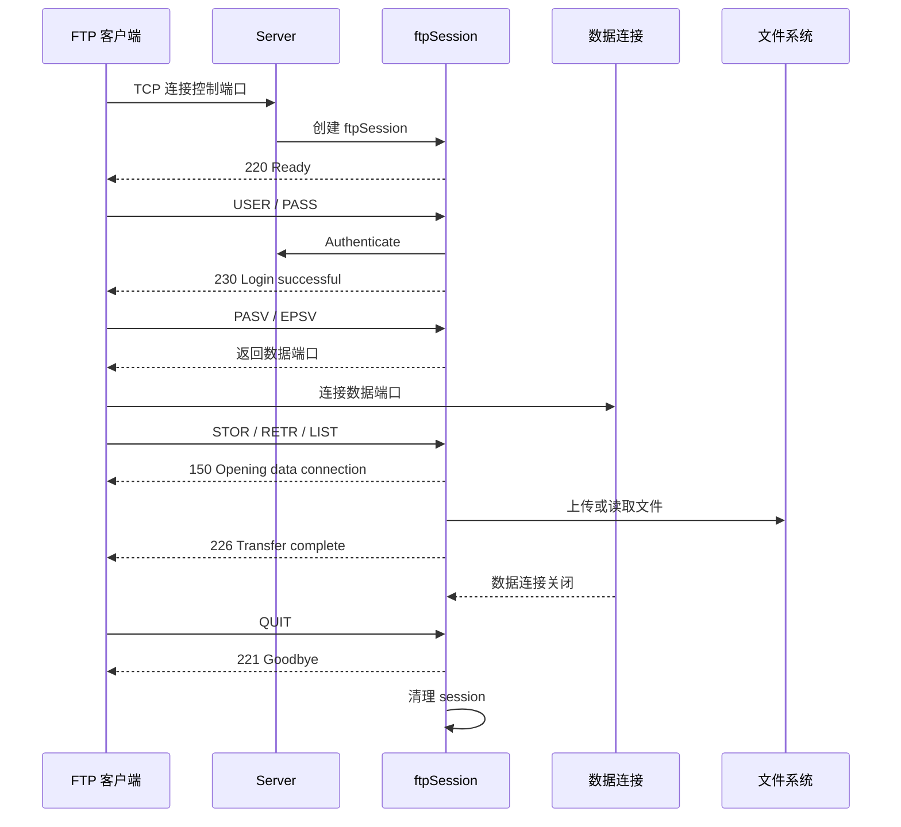

```mermaid
sequenceDiagram
    participant C as FTP 客户端
    participant S as Server
    participant F as ftpSession
    participant D as 数据连接
    participant FS as 文件系统

    C->>S: TCP 连接控制端口
    S->>F: 创建 ftpSession
    F-->>C: 220 Ready
    C->>F: USER / PASS
    F->>S: Authenticate
    F-->>C: 230 Login successful
    C->>F: PASV / EPSV
    F-->>C: 返回数据端口
    C->>D: 连接数据端口
    C->>F: STOR / RETR / LIST
    F-->>C: 150 Opening data connection
    F->>FS: 上传或读取文件
    F-->>C: 226 Transfer complete
    D-->>F: 数据连接关闭
    C->>F: QUIT
    F-->>C: 221 Goodbye
    F->>F: 清理 session
```