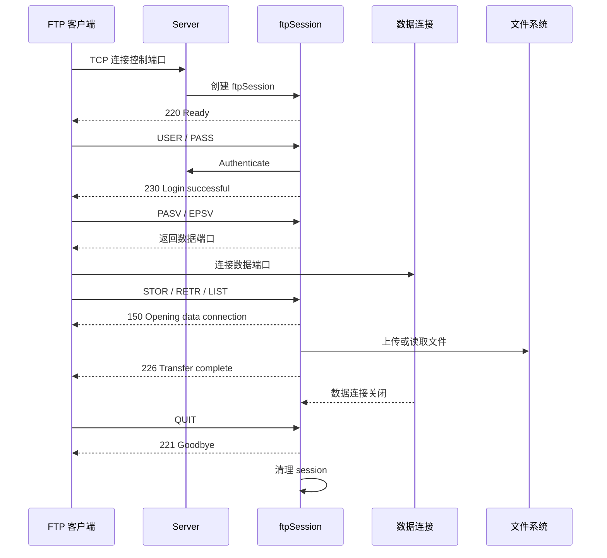

# CWNAS FTP 生命周期与优雅关闭

## 当前结论

FTP 必须区分两种停止语义：管理员调用 Stop 表示禁用服务并持久化 `enabled=false`；CWNAS 进程退出时调用 Shutdown 只释放当前运行资源，必须保留 `enabled=true`，以便下次启动仍按配置自动运行。

应用退出链路：

```text
应用 ctx.Done()
  -> Service.Shutdown(shutdownCtx)
  -> Server.Stop(shutdownCtx)
  -> 停止接受新连接
  -> 取消授权检查
  -> 关闭控制连接、被动监听器和数据连接
  -> 等待会话及后台协程退出
  -> 停止上传提交器
```

`shutdownCtx` 使用 FTP 配置中的 `ShutdownTimeout`。上传提交 worker 的等待也必须受同一 context 截止时间控制，避免数据库提交卡住时阻塞整个进程退出。

| 调用 | 使用场景 | 修改 `enabled` | 等待受 context 限制 |
| --- | --- | --- | --- |
| `Service.Stop(ctx)` | 管理员调用停止 API | 是，持久化为 `false` | 是 |
| `Service.Shutdown(ctx)` | CWNAS 应用退出 | 否 | 是 |

路由注册接收应用 context，在应用退出时触发 `Service.Shutdown`。不能直接复用 `Service.Stop`，否则一次正常关机会改变管理员期望的下次启动状态。

## 本地验证

定向测试已经证明：

- Shutdown 后 FTP 运行实例停止，但内存和数据库中的 `enabled=true` 保持不变。
- 上传提交 worker 未及时退出时，Shutdown 能按 context 超时返回。
- FTP 相关包测试、两条新增用例的竞态检查和 `cmd/server` 构建通过。

尚未进行真实进程信号退出或真机 FTP 会话验收。

相关系统 SSH 生命周期设计见 [[70-项目/01-CWNAS/CWNAS系统Shell SSH实现与验收|CWNAS 系统 Shell SSH 实现与验收]]。

## FTP 会话流程



## 来源

- Codex 会话：`01a05663-f6c1-79d0-938b-47c5377fcc13`
- 代码范围：`pkg/fileserver/ftp`、`pkg/fileserver/ftp/routes`、`cmd/server`
