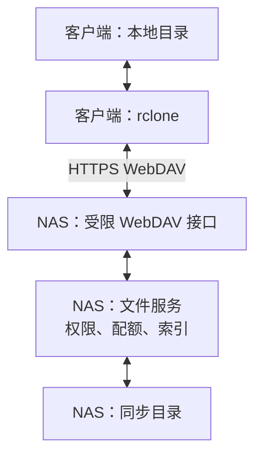
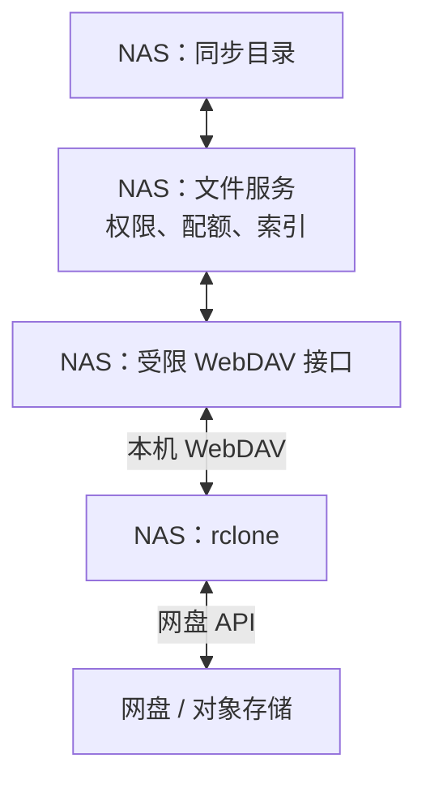
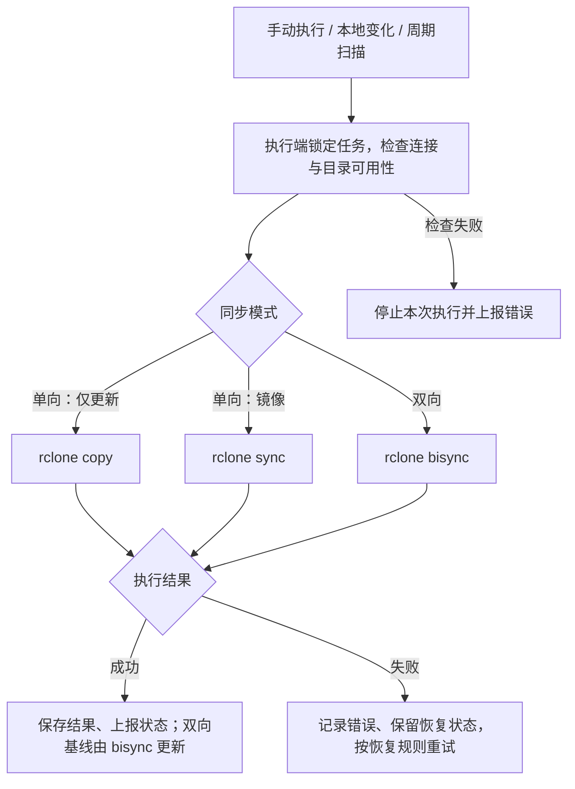
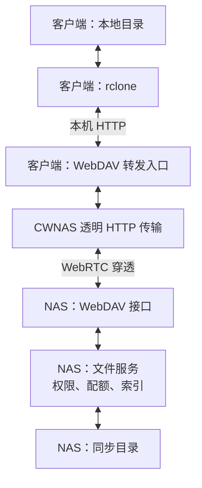

# CWNAS 文件同步方案对比

| 对比项    | fast_rsync 0.2.0 | Syncthing                      | rclone               |
| ------ | ---------------- | ------------------------------ | -------------------- |
| 系统     | 飞牛               | 绿联                             | TrueNas              |
| 实现语言   | Rust             | Go                             | Go                   |
| 开源协议   | Apache-2.0       | MPL-2.0                        | MIT                  |
| 操作对象   | 字节数据、签名、差分       | 多台设备上的文件夹                      | 本地目录、云盘、对象存储等        |
| 使用形式   | 程序调用库            | 两端运行同步服务， 需要客户端开启Syncting进程 | CLI、后台任务或程序集成        |
| 实时发现变化 | 需要自己实现           | 文件监听 + 周期扫描                    | 使用定时扫描               |
| 双向同步   | 需要自己实现决策         | 内置多设备双向同步                      | `bisync` 支持，通常定时执行   |
| 增量粒度   | 滚动匹配旧块，生成差分      | 按块哈希复用数据                       | 通常是文件级增量             |
| 典型用途   | 自研同步产品的传输优化      | 电脑 ↔ NAS、NAS ↔ NAS             | NAS ↔ S3、网盘、WebDAV 等 |

## rclone 实施计划

**一次性交付客户端同步和网盘同步，两类任务均支持单向、双向选项。CWNAS 负责权限、任务和调度，rclone 负责文件比较与传输。**

以下为待实施方案。交付范围包括服务端、客户端后台服务、WebDAV 接入、网盘连接、同步设置、运行状态和恢复机制。

### 1. 同步模式

创建任务时，先选择客户端目录或网盘目录，再选择单向同步或双向同步。

| 模式 | 选项 | rclone 命令 | 行为 |
| --- | --- | --- | --- |
| 单向同步 | 仅更新 | `copy` | 新增、更新目标文件，保留目标多余文件，不传播删除 |
| 单向同步 | 镜像 | `sync` | 目标与源保持一致，包括删除 |
| 双向同步 | 两端互相同步 | `bisync` | 比较两端变化，传播新增、修改和删除 |

单向同步需要选择方向：NAS → 客户端、客户端 → NAS、NAS → 网盘或网盘 → NAS。
双向同步不指定主从，两端均可修改。

默认使用单向更新。镜像和双向同步在首次运行前展示覆盖、删除及冲突处理规则。

能力边界：

- **近实时**：由 CWNAS 监听变化并触发 rclone；远端变化通常还需要轮询发现，不保证实时到达。
- **文件级增量**：跳过未变化文件；变化文件通常整文件重传，不具备 rsync 式二进制差分，就是不能将文件hash分块，按块同步，对于大文件的小修改性能较差。

### 2. 运行位置与文件接入

| 场景            | rclone 运行位置 | 接入方式                |
| ------------- | ----------- | ------------------- |
| NAS ↔ 云盘、对象存储 | NAS 后台      | 使用 rclone 已支持的远端    |
| 电脑 ↔ CWNAS    | 电脑客户端后台     | 本地目录 ↔ CWNAS WebDAV |

需要为 CWNAS 增加受限 WebDAV 接口，复用现有文件服务的认证、目录权限、配额和索引维护。当前自定义同步 API、TUS 上传接口不能直接交给 rclone 使用。

### 3. 数据流转图

实线表示文件内容的读写路径。双向箭头表示支持两个方向；单向任务只按用户选定的方向传输。变化清单和双向基线由执行任务的 rclone 维护。

#### 客户端与 NAS

#### NAS 与网盘

- **客户端任务**：客户端 rclone 在本地目录与 NAS 目录之间传输文件，客户端后台服务向 CWNAS 获取任务配置并上报状态。
- **网盘任务**：NAS rclone 在 NAS 目录与网盘目录之间传输文件，网盘凭据保存在 NAS。
- 每个任务只有一个执行端；客户端任务的双向基线保存在客户端，网盘任务的双向基线保存在 NAS。

任务执行流程：

### 4. CWNAS 的实现职责

#### 4.1 职责分工

- **连接管理**：配置远端、测试连接、安全保存凭据，日志隐藏敏感信息。
- **任务管理**：保存任务目标、两端目录、执行端、同步模式、单向方向、排除规则、执行周期和冲突策略。
- **执行器**：客户端和 NAS 使用相同的调用规则，负责启动 rclone、读取进度、停止进程和保存执行结果。
- **监听与调度**：CWNAS 发现变化并决定何时执行，rclone 扫描任务目录并决定传输哪些文件。
- **客户端与界面**：提供后台运行、任务设置、开始/停止、进度、历史、离线状态和冲突记录。

#### 4.2 如何调用 rclone

**电脑与 NAS 同步，由客户端调用 rclone；NAS 与网盘同步，由服务端调用 rclone。调用位置由任务类型决定，与单向、双向或上传、下载方向无关。**

两端后台服务持续运行，rclone 按任务启动子进程，完成后退出。下列命令表示参数结构，目录和远端名称均由任务配置生成。

##### 4.2.1 客户端：执行电脑与 NAS 同步

**运行位置：用户电脑上的 CWNAS 客户端后台服务。** 即使选择“NAS → 电脑”，也是客户端主动连接 NAS 并下载文件。

客户端需要准备：

| 项目     | 内容                                      |
| ------ | --------------------------------------- |
| 本地目录   | 用户选择的电脑文件夹，使用绝对路径                       |
| NAS 目录 | 配置为 `cwnas:docs`，通过 HTTPS WebDAV 访问授权目录 |
| 连接配置   | 保存在客户端，包含 NAS 地址和受限访问凭据                 |
| 双向状态   | 保存在客户端的独立任务目录，通过 `--workdir` 指定         |

根据用户选择生成命令：

| 模式与方向 | 命令主体 |
| --- | --- |
| 单向更新：电脑 → NAS | `rclone copy "<本地目录>" cwnas:docs` |
| 单向更新：NAS → 电脑 | `rclone copy cwnas:docs "<本地目录>"` |
| 单向镜像：电脑 → NAS | `rclone sync "<本地目录>" cwnas:docs` |
| 单向镜像：NAS → 电脑 | `rclone sync cwnas:docs "<本地目录>"` |
| 双向同步 | `rclone bisync "<本地目录>" cwnas:docs --workdir "<客户端任务状态目录>"` |

每条命令追加 `--config "<客户端配置文件>"` 和下文的日志、任务参数。

客户端执行流程：

1. **获取任务**：向服务端注册或读取任务，确认本地目录、NAS 目录、模式和方向；客户端只保存该任务所需的 NAS 凭据。
2. **等待触发**：本地文件变化、NAS 版本变化、定时扫描或用户点击开始时，合并触发事件，准备运行。
3. **启动同步**：检查本地目录与 NAS 连接，获取任务锁和 NAS 目录运行授权，再启动本机 rclone；运行期间的新变化保留到下一轮。
4. **展示与上报**：读取 rclone 进度供客户端显示，并向服务端上报运行状态；结束后保存结果，释放运行授权。上报失败的记录保存在本地，重连后补报。

电脑离线或客户端后台退出时，电脑同步任务暂停。重新启动后使用客户端保存的任务和双向状态重新扫描。

##### 4.2.2 服务端：管理任务并执行 NAS 与网盘同步

**运行位置：NAS 上的 CWNAS 后台服务。** 网盘同步不依赖电脑客户端在线。

服务端承担两类职责：

- **电脑同步任务**：保存配置、校验权限、提供 WebDAV 和 NAS 变化版本、分配运行授权、接收客户端状态；该任务的 rclone 由客户端执行。
- **网盘同步任务**：保存 NAS 与网盘连接配置，在 NAS 上启动 rclone，并直接记录运行结果。

网盘任务需要准备：

| 项目 | 内容 |
| --- | --- |
| NAS 目录 | 配置为 `cwnas:docs`，通过本机受限 WebDAV 访问 |
| 网盘目录 | 配置为 `cloud:docs`，使用对应网盘的 rclone 后端 |
| 连接配置 | 保存在 NAS，包含本机 WebDAV 与网盘凭据；网盘凭据不下发到客户端 |
| 双向状态 | 保存在 NAS 的独立任务目录，通过 `--workdir` 指定 |

根据用户选择生成命令：

| 模式与方向 | 命令主体 |
| --- | --- |
| 单向更新：NAS → 网盘 | `rclone copy cwnas:docs cloud:docs` |
| 单向更新：网盘 → NAS | `rclone copy cloud:docs cwnas:docs` |
| 单向镜像：NAS → 网盘 | `rclone sync cwnas:docs cloud:docs` |
| 单向镜像：网盘 → NAS | `rclone sync cloud:docs cwnas:docs` |
| 双向同步 | `rclone bisync cwnas:docs cloud:docs --workdir "<NAS任务状态目录>"` |

每条命令追加 `--config "<服务端配置文件>"` 和下文的日志、任务参数。

服务端执行流程：

1. **保存任务**：保存 NAS 目录、网盘连接、目标目录、模式、方向和执行周期，并测试连接。
2. **等待触发**：NAS 文件变化、定时扫描或用户点击开始时准备运行。网盘自身的变化通过周期运行 rclone 扫描发现。
3. **启动同步**：检查 NAS 存储与网盘连接，获取任务锁和目录运行授权，再启动 NAS 上的 rclone。
4. **记录结果**：读取进度，更新服务端任务状态供界面查询；结束后保存结果并释放授权，失败时按恢复规则处理。

#### 4.3 CWNAS 如何监听变化

| 变化来源                 | 监听与处理方式                                                      |
| -------------------- | ------------------------------------------------------------ |
| NAS 文件服务操作           | 文件写入及索引事务提交成功后发出变化提示，再标记相关同步任务                               |
| SMB、SSH 等直接修改 NAS 文件 | 复用 `pkg/file/storage` 的 `StartFileWatcher`，由现有流程更新索引后通知同步调度器 |
| 客户端目录变化              | 客户端后台服务监听本地目录的创建、修改、删除和重命名，标记对应任务                            |
| NAS 变化需要通知客户端        | 客户端通过认证接口查询变化版本；版本变化则触发任务，推送通知可用于提前唤醒                        |
| 网盘变化                 | NAS 按任务周期运行 rclone，扫描远端目录发现变化；不依赖本地文件监听                      |

当前文件服务已有提交后的文件树版本通知，可作为触发来源。全局版本只能说明 NAS 有变化，不能代替目录变更明细或 `bisync` 基线；无法定位具体目录时，可以保守触发相关候选任务，由 rclone 扫描确认。

#### 4.4 并发与异常恢复

- 同一任务只允许一个 rclone 进程。客户端与 NAS 上的任务由 CWNAS 统一检查目录重叠，申请 NAS 目录运行授权；授权失效后，WebDAV 拒绝旧运行继续写入。
- 网络错误按配置退避重试，认证失败和需要人工处理的基线错误暂停任务并显示原因。可在固定版本验证后启用 `--recover`、`--resilient`，不能用自动 `--resync` 绕过恢复失败。
- 服务重启时，将未结束的运行标记为中断，确认旧进程已退出，再使用原任务状态恢复执行；停止任务不会删除双向基线。

当前 `pkg/sync` 已有自行比较两端变化的流程。切换时停止旧任务并保留原数据和状态，为 rclone 建立基线；之后 CWNAS 只负责触发、执行和记录，同一任务不再并行运行原有比较逻辑。

### 5. 双向同步与恢复规则

| 情况           | 处理方式                           |
| ------------ | ------------------------------ |
| 首次运行，两端都有文件  | 预览差异，确定初始合并规则，再建立基线            |
| 两端同时修改同一文件   | 保留双方版本，记录冲突                    |
| 删除数量异常       | 中止任务；正常覆盖、删除也需要可恢复副本           |
| 断网、认证失败、磁盘掉线 | 判定失败，不能当作空目录传播删除               |
| 同步中断或状态损坏    | 保留现场，按恢复流程处理；不能自动执行 `--resync` |

同步目录需要可用性检查；双向同步状态不能随临时文件一起清理。恢复后重新检查两端状态，再继续执行。

### 6. 一次性交付与验收

| 验收范围 | 完成标准 |
| --- | --- |
| 客户端同步 | NAS 与客户端支持两个方向的单向更新、单向镜像及双向同步 |
| 网盘同步 | NAS 与选定网盘支持两个方向的单向更新、单向镜像及双向同步 |
| 自动运行 | 本地变化触发、周期扫描、离线恢复、重启后继续运行均可用 |
| 监听与调度 | 连续事件合并、运行期间新增事件、同步自身触发的事件、监听溢出和任务重叠均有验证 |
| 数据保护 | 首次合并、两端冲突、异常删除、断网和磁盘掉线均按规则处理 |
| 文件与任务状态 | 权限、配额、文件索引、进度、历史和冲突记录一致 |

使用真实临时目录验证文件结果与中断恢复，只运行涉及包的测试。每个对外支持的网盘后端都需验证列表、读写、删除和双向同步能力；客户端与网盘两类任务验收通过后统一交付。

## 穿透说明

**同步复用 CWNAS 现有的透明 HTTP 穿透能力。客户端提供本地 WebDAV 转发入口，rclone 访问本机入口，由 CWNAS 客户端负责连接 NAS。**

rclone 本身不识别 CWNAS 的 `428` 发现与 WebRTC 协议，不能直接把穿透虚拟地址当作普通 WebDAV 地址使用。接入后，第 4.2 节的同步命令主体不变，只调整客户端 `cwnas` 连接的访问地址。

### 数据流转

图中展示穿透路径；使用可达的 NAS 直连地址时，透明 HTTP 传输通过普通 HTTPS 访问 NAS。两种方式使用相同的同步模式、目录权限和双向状态。

### 客户端处理

1. **启动入口**：客户端后台启动本地 WebDAV 转发服务，仅监听 `127.0.0.1`，使用任务访问凭据。端口首次分配后保存并复用，保持访问地址与目录映射稳定。
2. **配置 rclone**：将 `cwnas` 连接指向本机入口，例如 `http://127.0.0.1:<端口>/dav/`。该地址是拟新增的本地入口，不是已有 NAS 路由。
3. **转发文件请求**：本地入口将请求交给现有透明 HTTP 模块，由它完成线路发现、可信 NAS 身份校验和连接建立，再转发给 NAS WebDAV。
4. **执行同步**：继续由客户端运行 `copy`、`sync` 或 `bisync`。即使方向是“NAS → 电脑”，也由客户端主动连接并下载。
5. **传输控制请求**：任务配置、NAS 变化查询、运行授权和状态上报由客户端直接使用透明 HTTP 模块访问，不需要经过 rclone。

### 服务端处理

- 将新增 WebDAV 接口注册到现有业务 HTTP Handler，穿透请求到达后执行正常的认证、目录权限、配额和文件索引维护。
- 服务端继续管理任务与运行授权，接收客户端状态；电脑同步的 rclone 进程仍由客户端持有。
- NAS 与网盘同步由 NAS 上的 rclone 直接访问网盘 API，通常不需要穿透，也不依赖电脑在线。

### 连接与恢复要求

| 项目 | 处理方式 |
| --- | --- |
| 穿透线路 | WebRTC 可使用直连；直连无法建立时，按已配置的可用 TURN 地址和凭据使用中继 |
| 平台职责 | 平台负责发现和信令；使用 TURN 时，中继转发加密后的数据 |
| WebDAV 转发 | 支持目录查询、上传、下载、创建、移动和删除；正确映射 `Destination`、`Location` 及目录列表中的路径 |
| 大文件传输 | 边接收边转发，保留 Range、条件请求、取消和超时语义，避免将整个文件缓存在内存 |
| 连接中断 | 向 rclone 返回明确错误，保留任务和双向状态；重新建连后按同步恢复规则继续执行 |
| 写请求重试 | 转发层不能擅自重放已经发送的写请求，也不能把连接失败转换为空目录 |
| 生命周期 | 客户端先准备转发入口和连接，再启动 rclone；停止时先结束任务，再释放转发入口和连接 |

可复用的源码接入点为 `pkg/net/http/transparent.NewTunnelTransport`、`pkg/net/http/tunnel.HTTPConnection`，以及 `cmd/server/main.go` 中接收穿透请求的 `g.BusinessHandler()`。

当前已确认的是穿透承载标准 HTTP 的基础能力。本地 WebDAV 转发入口、NAS WebDAV 接口，以及直连、TURN 中继、大文件传输和断线恢复的同步验收仍需实现并验证。
